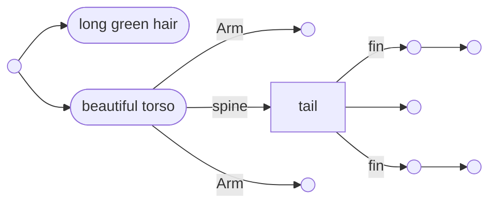

# Add Mermaid diagrams

To add a Mermaid diagram, add a code block and define its language as `mermaid`:

```mermaid
flowchart LR
    head --> hair([long green hair])
    head(( )) --> torso([beautiful torso])
    torso -- Arm --> leftArm(( ))
    torso -- spine --> tail
    torso -- Arm --> rightArm(( ))
    tail -- fin --> leftTip(( ))
    tail --> tip(( ))
    tail -- fin --> rightTip(( ))
    leftTip --> leftFin(( ))
    rightTip --> rightFin(( ))
```